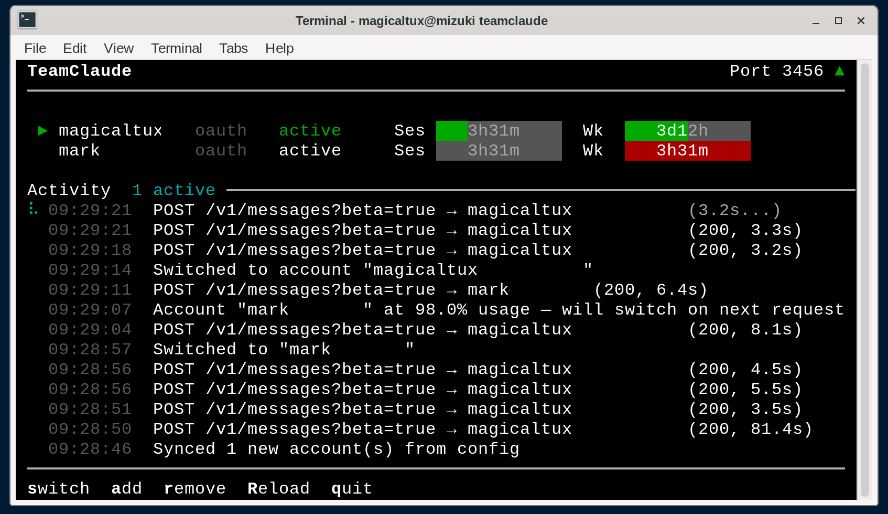

# NextClaude

Multi-account Claude proxy with automatic quota-based rotation for [Claude Code](https://claude.ai/claude-code).

Sits transparently between Claude Code and the Anthropic API, managing multiple Claude Max (or API key) accounts and automatically switching when one approaches its session or weekly quota limit.



## Features

- **Automatic account rotation** — switches to the next account when session (5h) or weekly (7d) quota reaches the configured threshold (default 98%)
- **Auto-retry on 429** — waits the `retry-after` duration and retries the same account; switches to the next on persistent errors
- **Interactive TUI** — real-time dashboard with color-coded quota bars, reset countdowns, activity log, and keyboard controls
- **OAuth token management** — automatically refreshes tokens nearing expiry and persists them to config; client token refreshes pass through untouched
- **Hot-reload accounts** — add accounts via `import` or `login` while the server is running, press **R** to pick them up
- **Account deduplication** — detects duplicate accounts by UUID and keeps the most recent
- **Request logging** — optional full request/response logging for debugging
- **Zero dependencies** — uses only Node.js built-in modules

## Quick Start

Requires Node.js 18+.

```bash
# Install
npm install -g nextclaude

# Add your first account (opens browser for OAuth)
nextclaude login

# Add a second account
nextclaude login

# Start the proxy
nextclaude server

# In another terminal, run Claude Code through the proxy
nextclaude run
```

You can also import existing Claude Code credentials instead of logging in:

```bash
claude /login           # Log into an account in Claude Code
nextclaude import       # Import its credentials
```

## Adding Accounts

### OAuth Login (recommended)

The easiest way to add accounts — opens your browser for authentication:

```bash
nextclaude login
```

Uses the same OAuth flow as Claude Code. Auto-detects the account email and subscription tier. Logging in with the same account again updates its credentials.

You can add accounts while the server is running — press **R** in the TUI to reload.

### Import from Claude Code

If you already have Claude Code set up, you can import its credentials directly:

```bash
claude /login           # Log into an account in Claude Code
nextclaude import       # Import its credentials
```

Re-importing the same account updates its credentials. You can also import from a custom path:

```bash
nextclaude import --from /path/to/credentials.json
```

### API Key

For Anthropic API key accounts (billed via Console):

```bash
nextclaude login --api
```

## Usage

### Start the proxy server

```bash
nextclaude server
```

When running from a TTY, shows an interactive TUI with:
- Account table with session/weekly quota progress bars and reset countdowns
- Real-time activity log with request tracking
- Keyboard shortcuts (see below)

Falls back to plain log output when not a TTY (e.g. running as a service).

#### TUI Keyboard Shortcuts

| Key | Action |
|-----|--------|
| `s` | Switch active account |
| `a` | Add account (import or API key) |
| `r` | Remove an account |
| `R` | Reload accounts from config |
| `q` | Quit |

In selection mode, use `j`/`k` or arrow keys to navigate, `Enter` to confirm, `Esc` to cancel.

### Run Claude Code through the proxy

```bash
nextclaude run
```

Or manually set the environment:

```bash
eval $(nextclaude env)
claude
```

### Other commands

```bash
nextclaude accounts          # List accounts with subscription tier and token status
nextclaude accounts -v       # Also show token expiry times
nextclaude status            # Show live proxy status (requires running server)
nextclaude remove <name>     # Remove an account
nextclaude api <path>        # Call an API endpoint with account credentials
nextclaude help              # Show all commands
```

### Request logging

Log full request/response details to a directory (one file per request):

```bash
nextclaude server --log-to /tmp/requests
```

## Configuration

Config is stored at `~/.config/nextclaude.json` (or `$XDG_CONFIG_HOME/nextclaude.json`). A random proxy API key is generated on first use.

Override the config path with `NEXTCLAUDE_CONFIG`:

```bash
NEXTCLAUDE_CONFIG=./my-config.json nextclaude server
```

### Config format

```json
{
  "proxy": {
    "port": 3456,
    "apiKey": "nc-auto-generated-key"
  },
  "upstream": "https://api.anthropic.com",
  "switchThreshold": 0.98,
  "accounts": [
    {
      "name": "user@example.com",
      "type": "oauth",
      "accountUuid": "...",
      "accessToken": "sk-ant-oat01-...",
      "refreshToken": "sk-ant-ort01-...",
      "expiresAt": 1774384968427
    }
  ]
}
```

| Field | Description |
|-------|-------------|
| `proxy.port` | Local port the proxy listens on |
| `proxy.apiKey` | API key clients use to authenticate with the proxy |
| `upstream` | Upstream API base URL |
| `switchThreshold` | Quota utilization (0–1) at which to switch accounts |

## How It Works

1. Claude Code connects to the local proxy instead of `api.anthropic.com`
2. The proxy selects the active account and forwards requests with that account's credentials
3. OAuth tokens expiring within 5 minutes are automatically refreshed and persisted to config
4. Rate limit headers from the API (`anthropic-ratelimit-unified-*`) track session (5h) and weekly (7d) quota utilization
5. When usage reaches the threshold, the proxy switches to the next available account via round-robin
6. On 429 responses, the proxy waits the `retry-after` duration and retries; on persistent errors, it switches accounts
7. Transient network errors (connection reset, timeout) drop the connection so the client can retry
8. If all accounts are exhausted, returns 429 with the soonest reset time
9. Client token refresh requests (`/v1/oauth/token`) are relayed to upstream untouched — the proxy and client manage their own token lifecycles independently

## License

MIT
